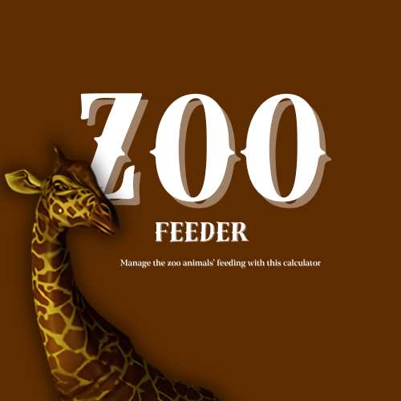

<!DOCTYPE html>

</head>
<body>
    <h1>ZooFeeder</h1>
    

        ZooFeeder é uma aplicação em Python desenvolvida para ajudar a gerenciar a alimentação de animais em zoológicos, calculando as quantidades necessárias de pacotes de comida com base nos animais selecionados. Este projeto inclui uma interface gráfica (GUI) criada com PyQt6, permitindo que os usuários selecionem facilmente os animais e visualizem as necessidades alimentares para cada rodada de alimentação.
    

    <h2>Inspiração</h2>
    
    

    A inspiração para esta aplicação veio do jogo de terror Zoochosis (https://store.steampowered.com/app/2458560/Zoochosis/), no qual o personagem principal é um funcionário de zoológico que precisa cumprir diversas tarefas, incluindo alimentar os animais em seus recintos. No jogo, o funcionário deve cuidar de quatro recintos diferentes, e cada um deles requer uma certa quantidade de comida.
    

    

       Como o personagem só pode carregar até 8 pacotes de comida por vez, o ZooFeeder foi criado para otimizar essa tarefa, ajudando a calcular a quantidade de comida que cada animal consome e a melhor combinação de pacotes para levar. Dessa forma, o programa sugere uma distribuição eficiente, permitindo que o personagem alimente dois recintos de animais de uma só vez (round 1) e outros dois na rodada seguinte (round 2). Isso reduz o número de viagens necessárias para buscar comida e garante que não haja falta de alimentos para os animais.
    

     

        A aplicação suporta uma variedade de animais, cada um com diferentes necessidades dietéticas, incluindo vegetais, 
        ervas, peixes e carne fixa. O usuário pode selecionar até quatro animais diferentes, e o programa calculará quantos 
        pacotes de cada tipo de comida são necessários para alimentá-los.
     

    <h2>Funcionalidades</h2>
    <ul>
        <li>
            <strong>Seleção de Animais:</strong> Os usuários podem selecionar animais a partir de um menu suspenso. 
            O programa garante que cada animal selecionado seja único e evita seleções duplicadas.
        </li>
        <li>
            <strong>Cálculo de Alimentação:</strong> A aplicação calcula os requisitos totais de alimentos para duas 
            rodadas de alimentação. Ela leva em conta diferentes tipos de comida: vegetais, ervas, peixes e carne fixa.
        </li>
        <li>
            <strong>Exibição de Resultados:</strong> Os resultados dos cálculos são exibidos em um diálogo separado, 
            mostrando os animais selecionados, o número de pacotes de alimentos necessários para cada tipo e o espaço 
            disponível no carrinho de alimentação.
        </li>
        <li>
            <strong>Interface Amigável:</strong> Desenvolvida com PyQt6, a GUI é intuitiva e fácil de navegar, 
            tornando-a acessível para usuários de todas as idades.
        </li>
    </ul>
    <h2>Stack Técnico</h2>
    <ul>
        <li><strong>Python:</strong> A linguagem de programação utilizada para desenvolver a aplicação.</li>
        <li><strong>PyQt6:</strong> Um conjunto de bindings em Python para o framework de aplicação Qt, utilizado para criar a interface gráfica.</li>
        <li><strong>Estruturas de Dados:</strong> Utiliza dicionários para armazenar dados de alimentação dos animais, permitindo a recuperação e o cálculo eficientes das quantidades de comida.</li>
    </ul>
 <h2>Como Executar a Aplicação</h2>
<ol>
    <li>
        Crie um ambiente virtual: É recomendado usar um ambiente virtual para gerenciar as dependências da aplicação. Para criar um ambiente virtual, use o seguinte comando:
        <pre><code>python -m venv myvenv</code></pre>
    </li>
    <li>
        Ative o ambiente virtual:
        <ul>
            <li>No Windows:
                <pre><code>myvenv\Scripts\activate</code></pre>
            </li>
            <li>No macOS e Linux:
                <pre><code>source myvenv/bin/activate</code></pre>
            </li>
        </ul>
    </li>
    <li>
        Clone o repositório:
        <pre><code>git clone git@github.com:leasju/ZooFeeder.git</code></pre>
        <pre><code>cd ZooFeeder</code></pre>
    </li>
    <li>
        Instale as dependências: Para instalar todas as dependências necessárias de uma vez, você pode usar o arquivo <code>requirements.txt</code> incluído no projeto. Execute o seguinte comando:
        <pre><code>pip install -r requirements.txt</code></pre>
    </li>
    <li>
        Execute a aplicação: Agora você pode executar o script principal:
        <pre><code>python app.py</code></pre>
    </li>
</ol>
<h2>Instruções de Uso</h2>
    <ol>
        <li>Ao iniciar a aplicação, você verá uma mensagem de boas-vindas e opções para selecionar animais.</li>
        <li>Escolha até quatro animais diferentes nos menus suspensos.</li>
        <li>Selecione se deseja seguir a ordem de seleção dos animais usando a caixa de seleção.</li>
        <li>Clique no botão "Enviar" para calcular os requisitos de alimentos. Os resultados serão exibidos em um novo diálogo.</li>
        <li>Você pode limpar as seleções clicando no botão "Limpar".</li>
    </ol>
    <h2>Melhorias Futuras</h2>
    <ul>
        <li>Incluir opções para que os usuários personalizem a quantidade de comida necessária para cada animal.</li>
        <li>Melhorar a GUI com funcionalidades adicionais, como imagens de animais e um layout mais interativo.</li>
    </ul>
</body>
</html>
